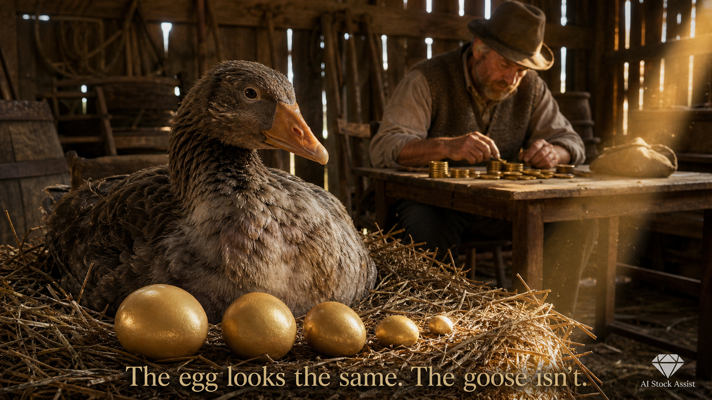
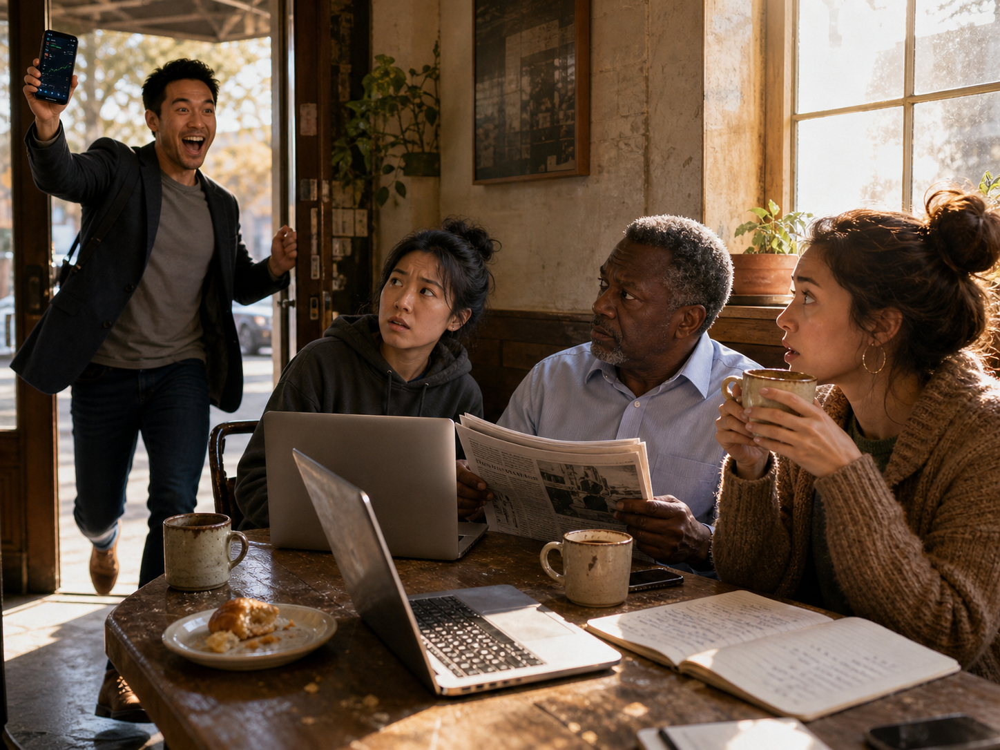
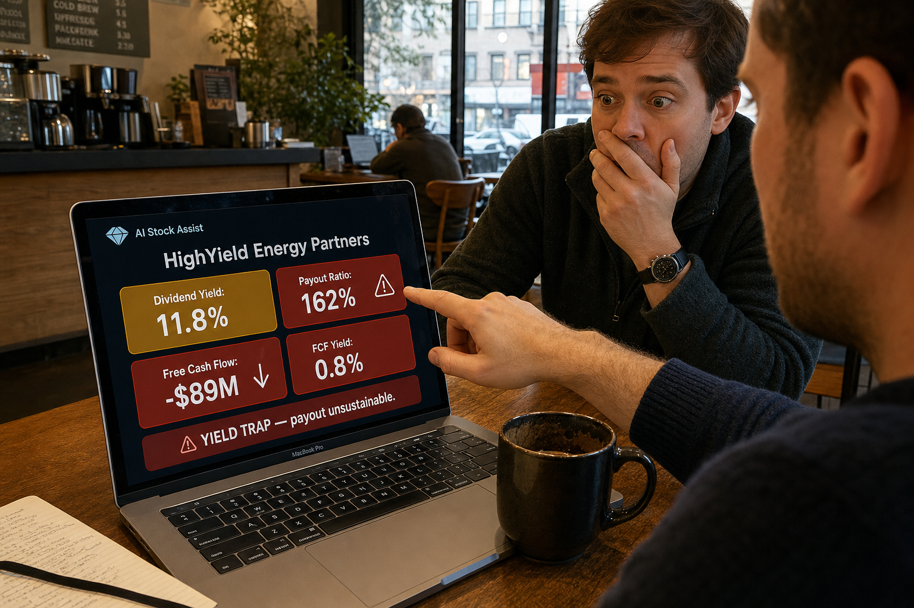
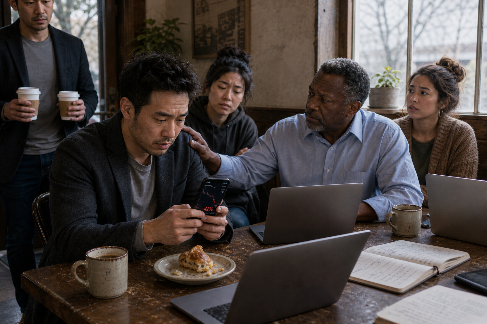

# Episode 5 — "The Trap" · Image Prompt Pack

In-article images (one hero plus three in-article + one optional bonus) that visually market AI Stock Assist as the tool that illuminates decisions. Plus a separate set of **promotional heroes** at the end of this file, designed for distribution on LinkedIn, Medium, Facebook, and X.

All prompts written for ChatGPT image generation, Midjourney, DALL-E, or Adobe Firefly. Adjust style keywords for your generator of choice.

**Brand consistency notes for every image:**
- **VISUAL STYLE — REAL-WORLD PHOTOGRAPHY, STUDIO QUALITY. PHOTOREALISTIC. NOT ILLUSTRATED. NOT AI-LOOKING.**

  Default direction to paste into every prompt:

  > *"Real-world editorial photography, studio-grade quality. Shot on a Sony A7R V or Canon EOS R5 with an 85mm prime lens at f/8 (deep depth of field — every detail tack-sharp foreground to background) (or 50mm for environmental scenes). Natural lighting or controlled key-and-fill studio lighting where applicable. Tack-sharp focus throughout — deep depth of field, every detail crystal-clear from foreground to background. NO blurred backgrounds, NO bokeh — readers want to see every detail. Real-people aesthetic with subtle imperfections — natural skin texture with visible pores, slight asymmetry, real freckles, wrinkles, age-appropriate features, hair flyaways, lived-in clothing. **Must look like an actual professional photograph, not a 3D render or AI generation.** Avoid the AI-typical tells: no plastic-glossy skin, no perfectly symmetrical faces, no over-smoothed features, no glassy uncanny-valley eyes, no rendered-looking hair. Reference style: documentary editorial photography in the spirit of Annie Leibovitz portraits, Joe McNally environmental shots, Platon's intimate close-ups, or Steve McCurry's National Geographic work."*
- Color palette: deep navy (#0F1A36) + warm gold (#D4A24A) + parchment cream (#F4ECD8) + a single accent of soft red (#C24747) when warning/danger is needed
- Lighting: warm, golden-hour, cinematic — natural window light or practical sources, not flat corporate stock-photo lighting
- Diversity in cast: Sarah Chen (East Asian woman, 28), Marcus Thompson (Black man, 52), Elena Rodriguez (Latina woman, 24), Jamie Park (Asian-American man, 31), Alex (ageless, ambiguous-ethnicity mentor figure, calm presence). All cast members must look like real photographed humans, not 3D-renders.
- Coffee shop is the recurring anchor — visible mugs, warm wood, soft window light, natural condensation on glass
- **AI Stock Assist diamond logo bottom-right corner** of the hero only (not in-article)
- Aspect: 1456 × 816 px for hero (16:9 Substack header) · 1200 × 800 px for in-article
- For graphics/infographics (#6, #7) where pure photorealism doesn't apply, use clean modern editorial graphic-design with photoreal embedded photo elements where appropriate.

---

## ⚡ Universal Style Snippet (paste into every prompt)

**IMPORTANT:** Image generators (Gemini Nano Banana, ChatGPT Image Gen, Midjourney, DALL-E, etc.) have **near-zero memory** — they read only the single prompt you give them. They do NOT see this file's brand-consistency notes. So every prompt must embed the photorealism direction **inline.** Every individual prompt below already includes this snippet baked in. For any NEW prompt, paste this block at the end:

> *Real-world editorial photography, studio-grade quality. Shot on a Sony A7R V or Canon EOS R5 with an 85mm prime lens at f/8 (deep depth of field — every detail tack-sharp foreground to background) (50mm for environmental scenes). Natural lighting or controlled key-and-fill studio lighting. Tack-sharp focus throughout — deep depth of field, every detail crystal-clear from foreground to background. NO blurred backgrounds, NO bokeh — readers want to see every detail. Real-people aesthetic — natural skin texture with visible pores, slight asymmetry, real freckles and wrinkles, hair flyaways, lived-in clothing. **Must look like an actual professional photograph — NOT a 3D render, NOT an AI generation, NOT a painting.** Strictly avoid the AI-typical tells: no plastic-glossy skin, no perfectly symmetrical faces, no over-smoothed features, no glassy uncanny-valley eyes, no rendered-looking hair, no surreal lighting. Reference style: documentary editorial photography in the spirit of Annie Leibovitz portraits, Joe McNally environmental shots, Platon's intimate close-ups, or Steve McCurry's National Geographic work.*

For infographics (#6, #7) where pure photorealism doesn't apply: use clean modern editorial graphic-design (Visual Capitalist / Morning Brew style) with photoreal embedded photo elements where applicable.

---

# In-Article Images (live in the Substack post)

---

## Image 1 — HERO · "The Sick Goose"

**Use:** Substack header, LinkedIn preview, OG card

**Generated:**

📂 File: [`docs/images/episode-5/EPISODE_05_HERO_sick-goose.png`](images/episode-5/EPISODE_05_HERO_sick-goose.png)

**Prompt:**

> A photorealistic National Geographic-quality photograph shot on a Canon EOS R5 with an 85mm prime lens at f/8 (deep depth of field — every detail tack-sharp foreground to background), golden-hour natural light streaming through barn slats. Foreground: a single living goose sitting in a real nest of straw, photographed with sharp focus on her eye. Real feather texture — barbs visible, slightly rumpled and dim around the breast, suggesting subtle illness without being cartoonish. Head drooping a fraction, eyes open and aware. In the nest beside her: five real golden eggs arranged in a row, each clearly smaller than the last (left to right: full-sized → shrunken). The graduated shrinking is the visual punchline — must read instantly. Sharp background detail: a farmer in a worn wool vest and weathered felt hat sits on a real wooden stool, hunched, counting gold coins on a scarred tabletop, oblivious — every coin, fabric weave, and table-grain visible. Warm parchment and amber tones, real dust motes in the shaft of light. A single shaft of golden light touches the smallest egg, casting a real shadow. Subtitle text overlay at the bottom in elegant serif: **"The egg looks the same. The goose isn't."** Small AI Stock Assist diamond logo in the bottom-right corner. **Photorealistic, documentary editorial style — must look like an actual photograph, not an AI render. Real skin texture on the farmer (visible pores, weathered hands), real fabric weave on the vest, no plastic-glossy surfaces.** 1456 × 816 px, 16:9.

---

## Image 2 — IN-ARTICLE · "The Announcement" (Opening Scene)

**Placement:** Right after "The Story So Far…" recap, before the dialogue begins. Sets the human stakes.

**Generated:**

📂 File: [`docs/images/episode-5/EPISODE_05_IMAGE_01_announcement.png`](images/episode-5/EPISODE_05_IMAGE_01_announcement.png)

**Prompt:**

> A warm, intimate coffee shop scene at late morning. Soft golden light streams through a tall window onto a worn wooden booth table. Four friends are gathered: Jamie (Asian-American man, 31, casual blazer over a t-shirt) is mid-burst through the door, arms slightly raised in triumph, grinning ear to ear, holding his phone aloft like a trophy with a stock chart visible on the screen. At the booth: Sarah (East Asian woman, 28, hoodie, laptop open, eyebrow raised in genuine concern), Marcus (Black man, 52, work shirt, newspaper half-lowered, weathered face with a skeptical frown — visible laugh lines and graying temples), Elena (Latina woman, 24, sweater, coffee cup paused at her lips, eyes wide with worry). On the table: chipped ceramic mugs with real coffee rings, a half-eaten croissant with crumbs, three open laptops with worn keys, a real notebook with handwritten ink. The composition centers on Jamie's exuberance against the others' careful, knowing concern. Mood: dramatic irony — the reader knows what Jamie doesn't. No text overlay.
>
> **Real-world editorial photography, studio-grade quality. Shot on a Sony A7R V with a 50mm prime lens at f/8 (deep depth of field — every detail tack-sharp foreground to background) for environmental framing. Natural window light as the key, warm tungsten ceiling lights as fill. Tack-sharp focus across the entire booth and all four faces — every cup, crumb, laptop key, notebook line, and facial expression crystal-clear. Real-people aesthetic — natural skin texture with visible pores, slight facial asymmetry, real freckles and wrinkles, hair flyaways, lived-in clothing with subtle wear. Must look like an actual professional photograph — NOT a 3D render, NOT an AI generation, NOT a painting. Avoid the AI-typical tells: no plastic-glossy skin, no perfectly symmetrical faces, no glassy uncanny-valley eyes. Reference style: documentary editorial photography in the spirit of Annie Leibovitz environmental portraits or Joe McNally's narrative scenes.** 1200 × 800 px.

---

## Image 3 — IN-ARTICLE · "The Demo" (THE PRODUCT MARKETING IMAGE)

**Placement:** In "The Sick Goose" section, right when Alex turns the laptop toward Jamie. **This is the image that sells AI Stock Assist.**

**Generated:**

📂 File: [`docs/images/episode-5/EPISODE_05_IMAGE_02_demo.png`](images/episode-5/EPISODE_05_IMAGE_02_demo.png)

**Prompt:**

> A close, slightly over-the-shoulder view of Alex's open MacBook on a coffee shop table. The laptop screen is the focal point of the entire image and shows a clean, modern dark-mode AI Stock Assist dashboard. Visible on the screen, in clear readable type: **"HighYield Energy Partners"** as a header, then four large data tiles in a 2x2 grid — **Dividend Yield: 11.8%** (gold tile), **Payout Ratio: 162%** (red tile, with a small warning triangle icon), **Free Cash Flow: -$89M** (red tile, downward arrow), **FCF Yield: 0.8%** (red tile — far below the 12% dividend it claims to pay). Below the tiles, a verdict banner in red text: **"⚠ YIELD TRAP — payout unsustainable."** The dashboard has the AI Stock Assist diamond logo in the top-left corner. In soft background focus around the laptop: Alex's real human hand (visible knuckles, light hair on the forearm, natural skin texture) pointing at the red Payout Ratio tile, Jamie's face partially visible across the table — eyes wide, color draining, the moment of realization captured. Warm golden ambient light from the coffee shop window with real glare on the laptop bezel. Real coffee mug condensation, a worn notebook beside the laptop. The screen content must be legible and accurate — every tile shown is a real metric the AI Stock Assist app computes today.
>
> **Real-world editorial photography, studio-grade quality. Shot on a Sony A7R V with a 35mm prime lens at f/8 (deep depth of field — every detail tack-sharp foreground to background) for the over-shoulder intimacy. Natural window light as key, no artificial fill. Tack-sharp focus across the entire scene — laptop screen content perfectly legible AND figures behind in equally crisp focus. NO blurred background. Real-people aesthetic — visible pores, real skin tones, no AI-typical glossy plastic faces. Must look like an actual photograph — NOT a 3D render, NOT an AI generation, NOT a painting. Avoid the AI tells: no perfectly clean screens (allow micro-fingerprints), no too-clean fingertips. Reference style: tech-editorial photography in the spirit of Wired magazine cover work, real-environment shots not stock-photo lighting.** 1200 × 800 px.

---

## Image 4 — IN-ARTICLE · "Six Weeks Later" (The Consequence)

**Placement:** At the start of the "Six Weeks Later" section. The emotional payoff that drives the lesson home.

**Generated:**

📂 File: [`docs/images/episode-5/EPISODE_05_IMAGE_03_six-weeks.png`](images/episode-5/EPISODE_05_IMAGE_03_six-weeks.png)

**Prompt:**

> The same coffee shop booth. Same table. Same wooden window light — but cooler, slightly grey, an overcast afternoon now. Jamie (Asian-American man, 31) sits slumped on one side of the booth, holding his phone in both hands, staring at it with a hollow expression — visible puffiness under his eyes suggesting he hasn't slept well, real stubble, hair slightly disheveled. The phone screen shows a stock chart with a sharp downward crash visible — a vertical drop with the price label "−42%" highlighted in red. His coffee sits untouched, a thin film on the surface from sitting too long. Across from him: Marcus (Black man, 52, weathered hands with visible veins) extends one hand toward Jamie's shoulder, supportive but quiet — the gesture small, real, fatherly. Sarah and Elena are visible in soft focus on the other side of the booth, exchanging a sympathetic look — Elena's mouth slightly open in concern, Sarah's eyes lowered. Alex stands at the edge of the frame, arriving with two paper coffee cups, his face showing that he already knows what happened. The atmosphere is quiet, mournful, but not hopeless — there's still warmth in the room, just chastened. No text overlay.
>
> **Real-world editorial photography, studio-grade quality. Shot on a Canon EOS R5 with an 85mm prime lens at f/8 (deep depth of field — every detail tack-sharp foreground to background) compressing the booth scene. Natural overcast window light as key — soft, diffused, slightly desaturated. Tack-sharp focus across the entire booth — Jamie's face in perfect detail, AND Marcus's hand, AND Sarah and Elena in the background equally sharp. Real-people aesthetic — visible pores, real skin tones, real eye redness from stress, no AI-typical perfection. Must look like a real photograph — NOT a 3D render, NOT an AI generation, NOT a painting. No glossy skin, no symmetrical AI faces, no glassy eyes. Reference style: emotional documentary photography in the spirit of Annie Leibovitz's intimate portraits or Eugene Smith's narrative photo essays.** 1200 × 800 px.

---

## Optional Image 5 — SOCIAL/TEASER · "The Sustainable Goose"

**Placement:** Optional callout image after "The Lesson" section, OR use as the LinkedIn carousel closing slide.

**Generated:**

📂 File: [`docs/images/episode-5/EPISODE_05_IMAGE_04_good-goose-ending.png`](images/episode-5/EPISODE_05_IMAGE_04_good-goose-ending.png)

**Prompt:**

> A bright, warm, hopeful real photograph. A healthy, vibrant white goose stands proudly in a sunlit real barnyard at midday — real grass, real worn fence posts, real apple orchard sharp in the background — every tree, every apple visible. Full clean plumage, alert and content, real feather detail. Beside her, a real woven wicker basket holds five identical, perfectly-sized golden eggs — all the same size, catching real sunlight. A small weathered wooden sign next to the basket, hand-painted in real signwriter's serif lettering: **"Yield: 3% · Payout: 44% · Cuts: 0"**. In the soft middle distance: an orchard with real apples on the trees, a farmhouse porch with a real rocking chair, suggesting decades of steady weather. Bright cream and gold tones, no shadows of warning. The visual contrast with Image 1 (the sick goose) is the entire point — same world, healthier inhabitant.
>
> **Real-world photography, studio-grade quality. Shot on a Canon EOS R5 with a 50mm prime lens at f/8 (deep depth of field — every detail tack-sharp foreground to background) for the environmental wide. Natural midday sun as key, no artificial fill. Tack-sharp focus throughout — the goose's eye, every basket-weave fiber, every word on the wooden sign, every apple in the orchard, every plank on the porch all crystal-clear. NO blurred background. Must look like an actual photograph — NOT a 3D render, NOT an AI generation, NOT an illustration. No surreal lighting, no over-saturated AI colors. Reference style: agricultural editorial photography in the spirit of Steve McCurry's National Geographic farm work or Sebastião Salgado's pastoral compositions.** 1200 × 800 px.

---

## How to use these in Substack

1. **Image 1 (Hero)** → Substack header upload + LinkedIn preview + Twitter/X card
2. **Image 2 (The Announcement)** → Drop into article right after "The Story So Far…" using Substack's image block
3. **Image 3 (The Demo — product marketing)** → Drop in "The Sick Goose" section. **This is the highest-impact product image — make it count.**
4. **Image 4 (Six Weeks Later)** → Drop at the start of the "Six Weeks Later" section
5. **Image 5 (Optional Sustainable Goose)** → If using, place after "The Lesson" section as a hopeful counter to the hero

For Substack, upload each image with a caption (Substack supports italic captions natively). Use the captions already in the markdown blog file as starting points.

---

# Promotional Heroes (drive traffic TO the post)

These four images aren't in-article — they ARE the social post itself. Each pulls a reader in with a question, names the lesson, and points to AI Stock Assist as the resolution. Different variations tuned to each platform's format and tone.

**Through-line:** The "Sick Goose" visual is recognizable across all four so the series builds visual equity over time. Brand colors and AI Stock Assist diamond logo on every one.

**Tagline to weave in:** *"In an era when many investments are AI hallucinations, AI Stock Assist is the AI that doesn't make things up. It does the math, shows the receipts, and tells you the truth — wealthy AND wise."*

---

## Promo Hero #1 — LinkedIn (Professional, executive tone)

**Format:** 1200 × 627 px (1.91:1 — LinkedIn's preferred share image ratio)
**Mood:** Direct, confident, business-grade. The kind of image that earns a stop on a LinkedIn feed scroll between two recruiter posts.
**Save as:** `docs/images/episode-5/EPISODE_05_PROMO_linkedin.png`

**Prompt:**

> A horizontal real photograph in the style of a high-end financial magazine cover (think Bloomberg Businessweek or The Economist). Left two-thirds: a real photographed white goose sitting in a real straw nest at golden hour, with five graduated real golden eggs in front of her — the leftmost large and bright, each successive one smaller and slightly dimmer, the rightmost shrunken and dull. Soft natural cinematic lighting from camera-right with real shadows. The goose looks alert but subtly weary, real feather detail visible. Right one-third: a clean dark navy panel (#0F1A36) overlaying the right side of the image with elegant serif white text:
>
> **$21,000 lost on a single "safe" dividend.**
>
> *The Golden Goose Trap — Episode 5*
>
> *The 30-second test that would have caught it. The metric every yield investor missed.*
>
> Smaller text at the bottom of the panel: *AI Stock Assist · Investing in the Intelligence Era*
>
> Below that, a small gold call-to-action button: *Read the Story →*
>
> AI Stock Assist diamond logo in the bottom-right corner of the image.
>
> **Real-world photography, studio-grade quality. Shot on a Sony A7R V with an 85mm prime lens at f/8 (deep depth of field — every detail tack-sharp foreground to background). Natural golden-hour sunlight as key. Tack-sharp focus throughout — every feather barb, every egg surface, every straw fiber crystal-clear. NO blurred areas. The text panel is a clean overlay on top of the photograph (do not generate the text as part of the image — generate the panel as a flat color block where text will be placed). Must look like an actual photograph — NOT a 3D render, NOT an AI generation, NOT an illustration. Reference style: editorial photography for Bloomberg Markets or The Economist covers.** 1200 × 627 px.

---

## Promo Hero #2 — Medium (Editorial, magazine-quality)

**Format:** 2080 × 1170 px (Medium recommends 16:9 for headers; this resolution renders crisply across breakpoints)
**Mood:** Slow, considered, literary. The kind of image that sits at the top of a thoughtful long-read and earns a reader's attention before the first paragraph.
**Save as:** `docs/images/episode-5/EPISODE_05_PROMO_medium.png`

**Prompt:**

> A wide cinematic real photograph in the spirit of a National Geographic environmental portrait. Centered composition: a real goose nest seen from a slightly low angle, real golden hour light streaming in from the left through real barn slats. In the nest, five real golden eggs arranged left-to-right — the leftmost full-sized and gleaming, each successive egg progressively smaller, the rightmost almost collapsed. The mother goose sits behind the eggs, her gaze direct toward the camera, her plumage subtly dim and rumpled, real feather texture — beautiful but unwell. In the soft middle distance: a real apple orchard at autumn, suggesting the older, slower farming world that knew better than to chase yields. In the deep background, almost out of focus: a real city skyline silhouette suggesting the modern market the goose was sold to. The contrast between rural wisdom and urban speculation is the visual subtext.
>
> A single line of elegant serif typography overlays the upper-left portion in cream text on subtle navy ink-stamp background:
>
> **One sick goose. $21,000 lost. The story every dividend investor needs to read.**
>
> Tiny attribution line below: *Episode 5 · Investing in the Intelligence Era · AI Stock Assist*
>
> No CTA button — the image trusts the reader to scroll to the headline below it. AI Stock Assist diamond logo in the bottom-right corner, very small.
>
> **Real-world photography, studio-grade quality. Shot on a Canon EOS R5 with a 35mm prime lens at f/8 (deep depth of field — every detail tack-sharp foreground to background) for the wide environmental composition. Natural golden hour light, real barn dust motes catching the rays. Tack-sharp focus from foreground to deep background — every feather barb, every egg surface, every orchard branch and every distant city silhouette equally crisp. The text overlay is composited on top — generate a flat space where the overlay will sit. Must look like an actual photograph — NOT a 3D render, NOT an AI generation, NOT a painting. Reference style: long-form editorial documentary photography in the spirit of Sebastião Salgado, Steve McCurry, or Annie Leibovitz environmental work.** 2080 × 1170 px.

---

## Promo Hero #3 — Facebook (Punchy, scroll-stopping)

**Format:** 1200 × 630 px (Facebook's preferred share image ratio)
**Mood:** Bold, dramatic, immediate. The kind of image that breaks a thumb-scroll mid-feed because the headline is *already* doing the work before the post text even loads.
**Save as:** `docs/images/episode-5/EPISODE_05_PROMO_facebook.png`

**Prompt:**

> A dramatic real-world close-up photograph. A real wooden nest in shadow occupies the bottom-left third — one large gleaming golden egg (real prop with metallic gold leaf finish) in the center of the nest, surrounded by three or four real crumpled, broken eggshells in dim gold and dust. A few real American twenty-dollar bills are mid-flight, captured by high-shutter-speed photography blowing out of the nest into the dark, partly torn, partly with singed/burning edges (real practical effects). The mother goose is mostly out of frame — only her real silhouette/shadow falls across the right side of the image, head down, defeated. A single shaft of cold blue light (not warm — practical gel filter) cuts across the broken eggshells, real dust motes visible.
>
> Bold sans-serif typography overlay across the upper-right two-thirds, in stacked lines:
>
> Top line, in heavy white sans-serif (very large): **12% YIELD.**
> Middle line, in warning red, slightly smaller: **$21,000 GONE.**
> Third line, in cream, smaller: *The Golden Goose Trap — Episode 5 of the Intelligence Era series.*
> Bottom-right corner badge in gold on navy: *Read the story → AI Stock Assist*
>
> The vibe is somewhere between a real Netflix thriller poster shot and a personal-finance warning ad photograph. It must stop the thumb. Color: deep navy background, warm gold accents on the egg, hot red on the headline, cold blue on the shaft of light. AI Stock Assist diamond logo in the bottom-right corner, inside the gold badge.
>
> **Real-world photography, studio-grade quality. Shot on a Sony A7R V with a 50mm prime lens at f/8 (deep depth of field — every detail tack-sharp foreground to background), dramatic chiaroscuro lighting (one hard key from above-left, hot blue rim from camera-right). Tack-sharp focus throughout — the central egg, every broken eggshell shard, every torn dollar bill, every dust particle in the light beam crystal-clear. (Some natural motion blur on the flying bills is fine — but the static elements are razor-sharp.) Must look like an actual photograph from a high-end photo studio — NOT a 3D render, NOT an AI generation, NOT a painting. No glossy CGI surfaces, no perfectly lit AI-typical compositions. Reference style: dramatic still-life photography in the spirit of Bloomberg Magazine cover shoots or Time magazine warning-piece photography.** 1200 × 630 px.

---

## Promo Hero #4 — X / Twitter ("Hallucinations" angle)

**Format:** 1200 × 675 px (X / Twitter card)
**Mood:** Surreal, intellectual, contrarian. Plays on the "AI hallucination" cultural moment.
**Save as:** `docs/images/episode-5/EPISODE_05_PROMO_twitter.png`

**Prompt:**

> A real-world photograph composited with subtle digital VFX. A real human trader (mid-30s, neutral ethnicity, business casual, photographed sitting at a desk) in a dim modern office at night, surrounded by multiple monitors. The screens display real-looking financial dashboards but with subtle glitches: pixelated edges, fragmenting chart lines, color-channel separation, ghosting — visualizing AI-generated investment "advice" hallucinating into noise. The VFX should look like real screen artifacts, not CGI. In the center foreground, his primary monitor shows one calm steady image: the AI Stock Assist diamond logo glowing softly, with a clean readable verdict below it: *"AVOID — payout ratio 162% — yield is a trap."* The trader's face is turned toward the calm verdict, away from the chaos. Real reflection of the screens in his real eyeglasses.
>
> Overlay text in elegant cream serif at the top: **In an era when investments are AI hallucinations,**
> Below in bolder sans-serif: **AI Stock Assist is the AI that doesn't make things up.**
> Bottom: *Episode 5 — The Golden Goose Trap → aistockassist.com*
>
> **Real-world photography, studio-grade quality. Shot on a Sony A7R V with a 35mm prime lens at f/8 (deep depth of field — every detail tack-sharp foreground to background). Practical screen-glow as key light on the trader's face (real screen output, not added in post). Tack-sharp focus across all monitors and the trader's face — every screen, every glitch artifact, every reflection in his eyeglasses crystal-clear. Real human skin texture, visible pores, real eye fatigue. The glitch VFX is added compositing — should look like real screen tearing, not CGI. Must look like an actual photograph — NOT a 3D render, NOT an AI generation, NOT a painting. No glossy AI faces. Reference style: real cinematic still photography in the spirit of Mr. Robot promotional shoots or Wired magazine hacker-culture editorial.** 1200 × 675 px.

---

## Posting strategy — how to use the four promos

| Image | Where | When | Caption to pair |
|---|---|---|---|
| **Promo #1 (LinkedIn)** | LinkedIn post | 30 min after Substack publish | The LinkedIn extract from the channel-variants section of the .md file |
| **Promo #2 (Medium)** | Medium cross-post header | Same day or next day | The full Substack longread, repurposed |
| **Promo #3 (Facebook)** | Facebook share | End of day | The Facebook variant (~210w) from the channel-variants section |
| **Promo #4 (X/Twitter)** | X / Twitter card | 2 hrs after Substack | The first tweet of the X thread |

The original in-article images (Hero sick-goose, announcement, demo, six-weeks, good-goose-ending) stay inside the Substack post itself. These four promos exist to *drive traffic to* that post.

---

# Dividend-Investor Targeted Graphics (additional)

These three additional graphics specifically target the **dividend investor** audience — passive-income builders, yield hunters, FIRE-movement readers, and the dividend-focused communities (r/dividends, r/dividendgang, r/passive_income, dividend-focused Substacks). They lean into the practical "should I buy this dividend stock?" use case rather than the parable.

---

## Promo Hero #5 — Dividend-Community Targeted (r/dividends, dividend Substacks)

**Format:** 1200 × 675 px (works for Reddit thumbnails, dividend-blog headers, X cards)
**Audience:** Active dividend investors deciding their next position
**Save as:** `docs/images/episode-5/EPISODE_05_PROMO_dividend-community.png`

**Prompt:**

> A clean split-panel real photograph optimized for dividend-investor audiences. Left panel (1/2 of image): a real photographed sick-looking goose in dim amber light, wearing a small slightly-tarnished real golden crown prop tilted on its head, sitting on a real nest with five GRADUATED real golden eggs (each clearly smaller than the last). Beneath the panel, three stat tiles in muted red: *Yield 11.8% · Payout 162% · FCF -$89M.* Subtitle below in red sans-serif: **"The Imposter."**
>
> Right panel (1/2 of image): a real photographed healthy goose in bright midday light, wearing a clean polished real golden crown prop, sitting on a real nest with five IDENTICAL real golden eggs all the same size. Beneath the panel, three stat tiles in green: *Yield 3.1% · Payout 44% · FCF +$18B.* Subtitle below in green sans-serif: **"The Real Dividend King."**
>
> Top header overlay across both panels in elegant cream serif: **"Both wear the crown. Only one is a real Dividend King."**
>
> Bottom strip in deep navy with white text: *"The Sick Goose — Episode 5 of the Intelligence Era series. Read the story → AI Stock Assist."*
>
> AI Stock Assist diamond logo in the bottom-right corner. Color palette: warm gold + dim red on the left panel, fresh green + bright cream on the right panel. The visual contrast IS the article in one image.
>
> **Real-world photography, studio-grade quality. Both panels shot on a Sony A7R V with an 85mm prime lens at f/8 (deep depth of field — every detail tack-sharp foreground to background). Left panel: low-key warm tungsten lighting, dim and moody. Right panel: bright natural daylight, clean and crisp. Tack-sharp focus on each goose AND its background — every feather barb, every crown detail, every blade of grass behind, every fence post crystal-clear in both panels. Must look like two actual photographs — NOT 3D renders, NOT AI generations, NOT illustrations. No glossy CGI feathers, no fake-looking crowns. Reference style: real prop-driven editorial photography in the spirit of National Geographic animal portraits with subtle costuming.** 1200 × 675 px.

---

## Detailed Graphic #6 — "The Dividend Investor's 3-Question Check"

**Format:** 1200 × 1200 px (square, optimized for Instagram, LinkedIn carousel slide, Pinterest, save-to-screenshot)
**Use:** Drop in the article right before "Try This Yourself," or share as a standalone infographic with a link back to the post
**Save as:** `docs/images/episode-5/EPISODE_05_GRAPHIC_3-question-check.png`

**Prompt:**

> A clean modern infographic in the style of a Visual Capitalist or Morning Brew explainer. Square format. Header at the top in heavy sans-serif on deep navy: **"BEFORE YOU BUY ANY DIVIDEND STOCK"**
>
> Subheader in cream: *"The Dividend Investor's 3-Question Check"*
>
> Below, three numbered cards stacked vertically, each with a clear icon, the metric name, the question, and the green/red answer thresholds:
>
> **Card 1** (icon: dollar-sign in a circle):
> *Q1 — What is the Dividend Yield?*
> ✓ 2-5% = healthy income
> ✗ Over 8% = often unsustainable
>
> **Card 2** (icon: a slice taken out of a pie):
> *Q2 — What is the Payout Ratio?*
> ✓ Under 60% = plenty of room
> ✗ Over 100% = borrowing to pay (cut coming)
>
> **Card 3** (icon: a flowing stream):
> *Q3 — Is Free Cash Flow positive?*
> ✓ Positive & growing = real money
> ✗ Negative = the dividend is borrowed
>
> At the bottom of the graphic, in cream on navy: *"All three answers green = a healthy goose. Even one red = walk away."*
>
> Below that, a small AI Stock Assist diamond logo + URL: *"Check any stock in 30 seconds → aistockassist.com"*
>
> Color palette: deep navy background, warm gold accents, green checkmarks, red X marks. Typography hierarchy is critical — readers should be able to absorb the entire graphic in 5 seconds. 1200 × 1200 px.

---

## Detailed Graphic #7 — "20-Year Compound Reality" Chart

**Format:** 1200 × 800 px (article-width)
**Use:** Drop in the article in or just after "The Math That Matters" section, OR as the close to the "Six Weeks Later" emotional moment, OR as a LinkedIn standalone post
**Save as:** `docs/images/episode-5/EPISODE_05_GRAPHIC_20-year-compound.png`

**Prompt:**

> A clean financial chart visualization, real-world editorial graphic-design quality (Bloomberg Markets / The Economist data-visualization aesthetic). The chart shows two lines plotted over a 10-year timeline:
>
> **Line A (red, dim, jagged):** $10,000 invested in HighYield Energy at year 0. Starts at $10K, climbs slightly with reinvested dividends through year 1 and 2, then plummets sharply at year 2.5 (the dividend cut event), continues to decline, ending at roughly **$4,200** at year 10. A small label tag mid-line: *"12% yield. Cut 3×. -58% total return."*
>
> **Line B (green, smooth, gently rising):** $10,000 invested in Johnson & Johnson at year 0. Steady, slightly accelerating climb with reinvested dividends, ending at roughly **$15,200** at year 10. A small label tag mid-line: *"3% yield. Steady. +52% total return."*
>
> Vertical axis labeled "Portfolio Value." Horizontal axis labeled "Years (reinvested dividends)."
>
> Bold headline at top: **"The Boring 3% Beat the Exciting 12% By 110 Points."**
>
> Subhead: *"Same starting capital. Ten years. One sustainable. One a trap."*
>
> Bottom strip with AI Stock Assist branding: *"Episode 5 — The Sick Goose. Read the full story → aistockassist.com."*
>
> Color palette: dark navy chart background, warm gold gridlines, dim red for the trap line, fresh green for the healthy line. AI Stock Assist diamond logo bottom-right.
>
> **Editorial-grade data visualization quality. Clean vector chart aesthetic. NOT a painterly illustration, NOT an AI-typical infographic with rendered 3D glass effects. Reference style: Bloomberg Markets, The Economist data graphics, or Visual Capitalist clean financial charts. Numbers and labels must be perfectly legible.** 1200 × 800 px.

---

## Detailed Graphic #8 — "The Crown of Imposters" (Dividend King angle)

**Format:** 1200 × 800 px (wide hero or in-article)
**Use:** Drop in the article right after the "Who This Episode Is For" section, OR as a standalone share for dividend-focused subreddits / LinkedIn carousels
**Save as:** `docs/images/episode-5/EPISODE_05_GRAPHIC_crown-of-imposters.png`

**Prompt:**

> A horizontal real-world photograph. A row of FIVE real photographed geese stand side-by-side in a real sunlit barnyard, each wearing a small real golden crown prop (lightweight metal/gilt, sized for an animal — costume-grade, not CGI). From left to right:
>
> - Goose 1: tall, healthy, alert, plumage gleaming, crown polished. A small label tag reads *"J&J — 60+ years."*
> - Goose 2: similar — healthy, proud, crown polished. Label: *"Coca-Cola — 60+ years."*
> - Goose 3: middle — healthy, proud, crown polished. Label: *"Procter & Gamble — 65+ years."*
> - Goose 4 (the imposter — visually different): hunched slightly, plumage dim and rumpled, crown sitting crooked and tarnished. Label in red: *"HighYield Energy — looks the same."*
> - Goose 5: healthy again, crown polished. Label: *"3M — 65+ years."*
>
> Top header overlay in elegant cream serif on a translucent navy band: **"Five Crowns. Four Real Kings. One Imposter."**
>
> Subhead below in cream sans-serif: *"Dividend Kings have raised their payouts through wars, recessions, and three generations of customers. Imposters look identical from the outside — until the goose dies."*
>
> Bottom strip in deep navy: *"Episode 5 — The Sick Goose. Spot the imposter in 30 seconds → aistockassist.com."*
>
> Color palette: warm afternoon barnyard light, gold accents on the crowns, one subtle red tinge around the imposter goose. AI Stock Assist diamond logo bottom-right. The visual punch is that without the labels, the imposter looks identical at first glance — and the reader's eye has to find it.
>
> **Real-world photography, studio-grade quality. Shot on a Canon EOS R5 with a 50mm prime lens at f/8 (deep depth of field — every detail tack-sharp foreground to background) for the wide group composition. Natural late-afternoon barnyard sunlight as key, soft fill from camera-right. Tack-sharp focus across ALL FIVE geese AND the entire background — every feather barb, every crown detail, every blade of grass and weathered fence-post crystal-clear edge to edge. NO blurred geese at the edges. Real metal/gilt crown props (not CGI). Must look like an actual photograph from a real prop-driven photo shoot — NOT a 3D render, NOT an AI generation, NOT a painting. No glossy CGI feathers, no fake-looking crowns, no perfectly identical AI-rendered geese (real photographs have natural variation). Reference style: real prop-driven editorial animal photography in the spirit of National Geographic feature stories or high-end brand campaigns.** 1200 × 800 px.

---

## Image storage convention

All Episode 5 images live in: **[`docs/images/episode-5/`](images/episode-5/)**

| File | Purpose | Status |
|---|---|---|
| `EPISODE_05_HERO_sick-goose.png` | Substack header / LinkedIn preview | ✅ Generated (ChatGPT, photoreal w/ caption + logo) |
| `EPISODE_05_IMAGE_01_announcement.png` | In-article — opening scene | ✅ Generated (ChatGPT) |
| `EPISODE_05_IMAGE_02_demo.png` | In-article — product marketing shot | ✅ Generated (ChatGPT — clean 4-tile + YIELD TRAP banner) |
| `EPISODE_05_IMAGE_03_six-weeks.png` | In-article — emotional payoff | ✅ Generated (ChatGPT) |
| `EPISODE_05_IMAGE_04_good-goose-ending.png` | In-article — sustainable Dividend King ending | ✅ Generated (Gemini — clean sign typography) |
| `EPISODE_05_PROMO_linkedin.png` | Promo for LinkedIn share | ⚠️ Generated (ChatGPT — empty text panel; **add "$21,000 lost on a single 'safe' dividend" text overlay in post**). Gemini version had garbled text |
| `EPISODE_05_PROMO_medium.png` | Promo for Medium cross-post | ✅ Generated (Gemini — overlay text rendered cleanly) |
| `EPISODE_05_PROMO_facebook.png` | Promo for Facebook share | ⚠️ Generated (Gemini — note: includes extra word "warning" before "$21,000 GONE" — minor flaw, still readable) |
| `EPISODE_05_PROMO_twitter.png` | Promo for X / Twitter card | ✅ Generated (Gemini — full hallucinations tagline overlay clean) |
| `EPISODE_05_PROMO_dividend-community.png` | Promo for r/dividends and dividend-focused communities | ⏳ To be generated |
| `EPISODE_05_GRAPHIC_3-question-check.png` | Square infographic — 3-question dividend check (LinkedIn carousel / Pinterest / save) | ⏳ To be generated |
| `EPISODE_05_GRAPHIC_20-year-compound.png` | Chart graphic — 20-year compound reality (J&J vs HighYield) | ⏳ To be generated |
| `EPISODE_05_GRAPHIC_crown-of-imposters.png` | Wide infographic — five crowns, four real Dividend Kings + one imposter | ⏳ To be generated |
